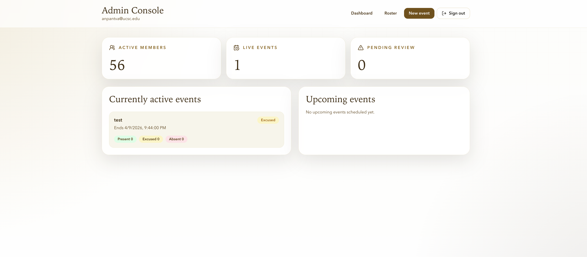
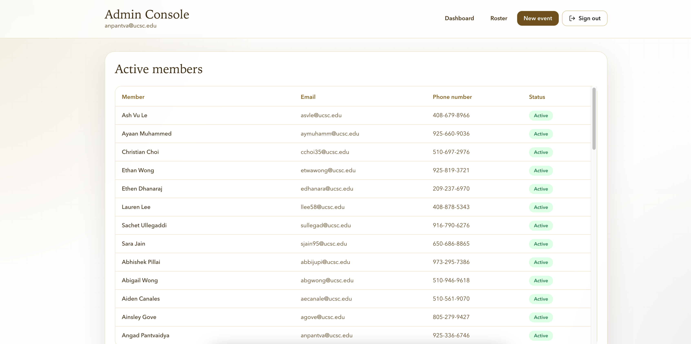
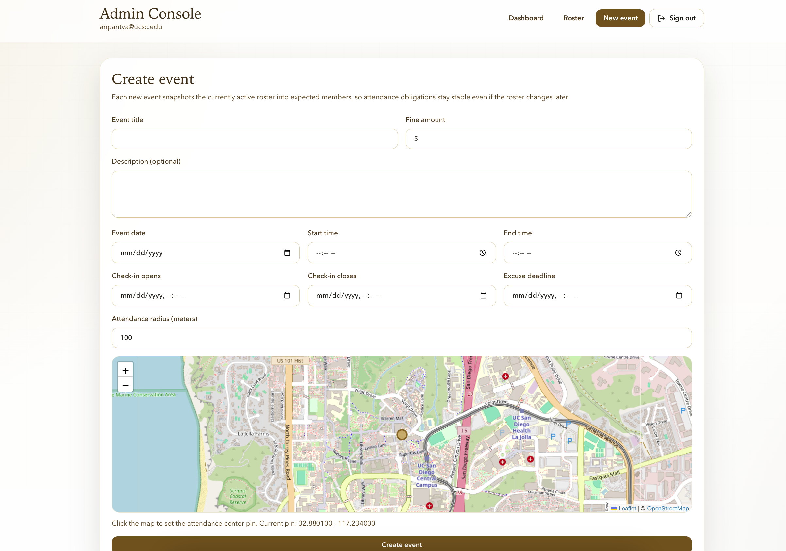

# AKPsi Attendance

Production-style attendance tracking for a student organization. This app replaces a weak Google Form workflow with magic-link sign-in, geolocation-based check-in, excuse submissions, admin event operations, and draft fine generation.

## Problem

AKPsi needed a more reliable way to track attendance across chapter events. The old process was too manual and inefficient: attendance collection, excuse handling, and follow-up on missed events took too much admin effort and left too much room for inconsistency. This project centralizes those workflows into a single system that is faster to operate and easier to trust.

## Screenshots

### Sign in


### Admin dashboard



### Active members roster



### Create event



## Features

- Email magic-link auth with Supabase
- Local dev auth bypass for testing when email rate limits get in the way
- Member dashboard with active and upcoming events
- Browser geolocation check-in with server-side distance validation
- Excuse submission with optional proof image upload
- Admin event creation with map pin selection and configurable radius
- Admin event review with manual overrides and excuse approval/rejection
- Draft fine generation for absent unexcused members
- Default active roster sourced from `actives.csv`

## Tech stack

- Next.js App Router
- TypeScript
- Tailwind CSS
- Supabase Auth, Postgres, and Storage
- Leaflet / React Leaflet

## Product rules

- Email is the identity key for members and admins.
- Every active member is expected at every new event.
- New events snapshot the current active roster into `event_expected_members`.
- Excuses are valid by default unless an admin overrides them.
- If a member both checks in and submits an excuse, the final result is `Present`.
- Fine drafts are generated only after admin review; no SMS sending is implemented in V1.

## Project structure

```text
app/
  admin/                 Admin dashboard, roster, event creation, event review
  auth/callback/         Supabase auth code exchange
  login/                 Sign-in screen
  member/                Member dashboard, check-in, excuse flow
components/
  admin/                 Admin UI
  auth/                  Sign-in UI
  member/                Member UI
  ui/                    Shared primitives
lib/
  actions/               Server actions
  auth.ts                Route guards
  csv.ts                 CSV parsing
  default-roster.ts      actives.csv loading and sync
  data.ts                Server-side queries
  domain.ts              Attendance status logic
  geo.ts                 Haversine distance calculation
  supabase/              Browser/server/admin Supabase clients
supabase/
  schema.sql             Database schema and policies
  seed.sql               Admin seed records
photos/                  README screenshots
actives.csv              Default active member roster
```

## Getting started

### 1. Install dependencies

```bash
npm install
```

### 2. Create a Supabase project

- Create a new project in Supabase.
- Go to `Project Settings > API`.
- Copy:
  - `Project URL`
  - `anon public`
  - `service_role`

### 3. Configure environment variables

Copy `.env.example` to `.env.local` and fill in:

```bash
NEXT_PUBLIC_SUPABASE_URL=...
NEXT_PUBLIC_SUPABASE_ANON_KEY=...
SUPABASE_SERVICE_ROLE_KEY=...
NEXT_PUBLIC_SITE_URL=http://localhost:3000
DEV_AUTH_BYPASS_ENABLED=false
```

### 4. Run the database setup

In the Supabase SQL Editor:

1. Run `supabase/schema.sql`
2. Edit `supabase/seed.sql` with your real admin emails
3. Run `supabase/seed.sql`

### 5. Configure auth URLs in Supabase

In `Authentication` settings, add:

```text
http://localhost:3000
http://localhost:3000/auth/callback
```

### 6. Start the app

```bash
npm run dev
```

Open:

```text
http://localhost:3000
```

## Local dev auth bypass

If Supabase email rate limits block local testing, enable:

```bash
DEV_AUTH_BYPASS_ENABLED=true
```

Then restart the app. The login page will show a `Local dev bypass` form that signs in using a local cookie instead of sending a magic link.

This should stay disabled in deployed environments.

## Default roster

The app uses `actives.csv` in the repo root as the default active roster source.

Expected columns:

```csv
Name,Student ID,Email,Phone Number
Jane Doe,1234567,jane@example.edu,555-111-2222
John Smith,7654321,john@example.edu,555-333-4444
```

Notes:

- `full_name` or `name` both work for member names.
- `email` is required and normalized to lowercase.
- `phone number` is displayed on the admin roster page.
- Malformed rows are ignored instead of crashing the app.
- Syncing the default roster marks previous members inactive and upserts the valid active set.

## Main flows

### Member flow

- Sign in with email magic link
- View active and upcoming events
- Check in during the event window
- Grant browser geolocation permission
- Submit excuses before each event’s deadline

### Admin flow

- Review the active members roster
- Create events with time windows, map pin, radius, and fine amount
- Review attendance and excuse records by event
- Override statuses and resolve edge cases
- Generate draft fine messages for absent unexcused members

## Final status logic

- Successful check-in => `Present`
- No check-in + valid excuse => `Excused`
- No check-in + no valid excuse => `Absent Unexcused`
- Manual override on `event_expected_members.manual_status` wins

## Storage

- Excuse proof images are stored in the `excuse-proofs` Supabase bucket.
- This MVP uses public file URLs for operational simplicity.

## Architecture notes

- Geofence validation happens on the server.
- `lib/default-roster.ts` syncs `actives.csv` into the `members` table.
- Authenticated app pages render dynamically at request time.
- `lib/domain.ts` centralizes final attendance status resolution.

## Future work

- SMS sending via Twilio
- Delivery/audit tracking for fines
- Member-facing attendance history
- Stronger storage privacy with signed URLs

## Build status

Production build currently passes with:

```bash
npm run build
```
